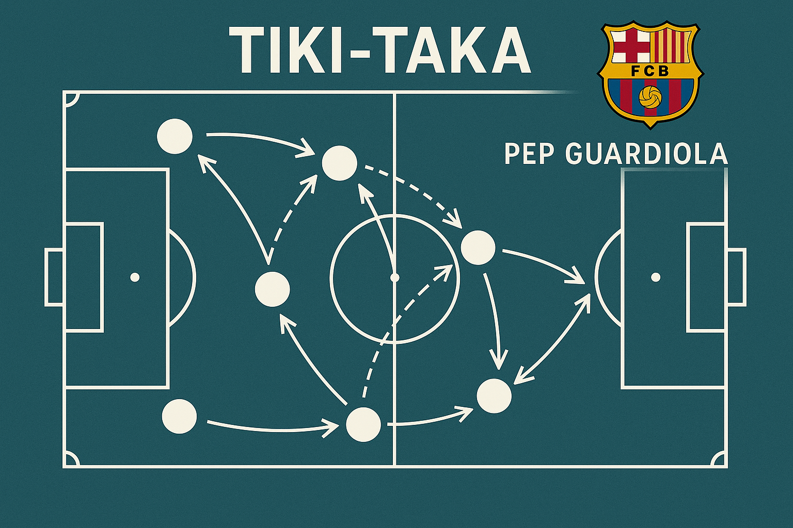

## L'Evoluzione del Sistema

### Origini e Sviluppo
- **Eredità di Cruyff**: Le basi filosofiche del calcio totale
- **Guardiola al Barcellona**: La perfetta implementazione
- **Diffusione globale**: Come il sistema ha influenzato il calcio mondiale

### Principi Fondamentali
1. **Possesso palla prolungato**: Mantenere il controllo del gioco
2. **Pressing alto**: Recuperare immediatamente la palla
3. **Movimenti senza palla**: Creazione continua di spazi
4. **Passaggi corti**: Precisione e controllo

## Analisi Statistica

I dati mostrano come le squadre che applicano il tiki-taka abbiano:
- 65%+ di possesso palla medio
- 90%+ di precisione nei passaggi
- Riduzione significativa dei contropiedi subiti

## Impatto sul Calcio Moderno

Il tiki-taka ha influenzato:
- La formazione dei giovani calciatori
- Le tattiche difensive avversarie
- L'evoluzione del ruolo del portiere

Questa filosofia di gioco continua a evolversi, adattandosi alle nuove esigenze del calcio contemporaneo.

